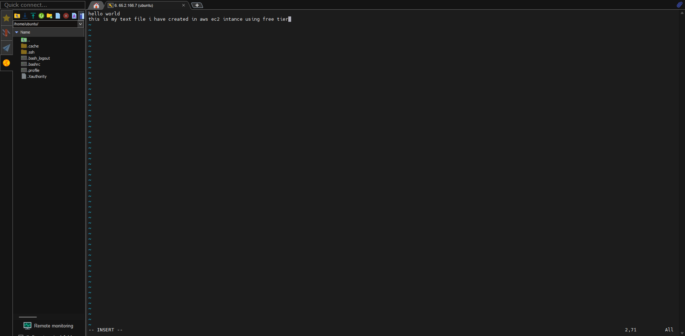
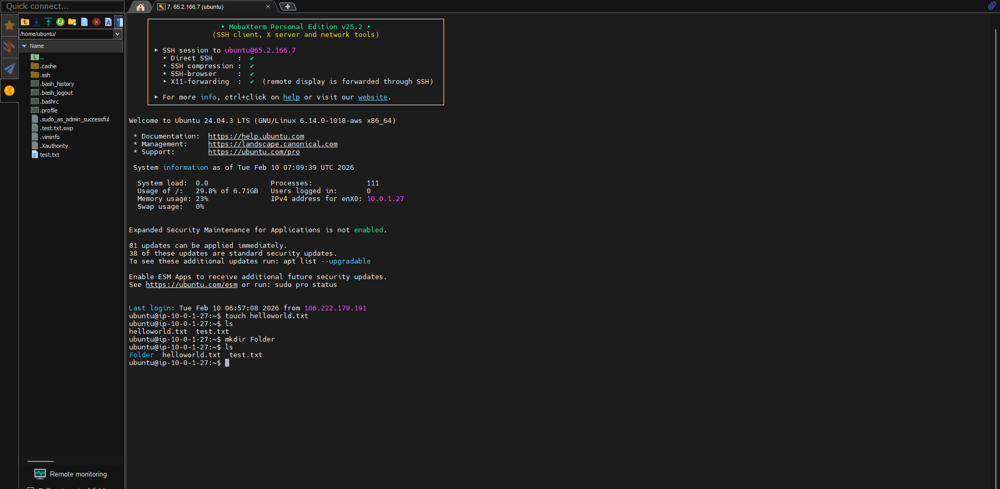
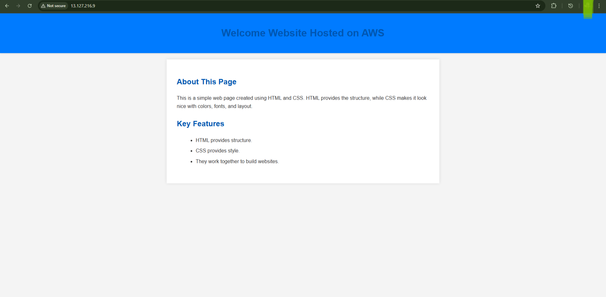

# AWS-EC2-Linux-Support-Troubleshooting

## 📌 Project Overview
This project demonstrates **core AWS Cloud + Linux administration skills** expected from a **Cloud / AWS L1 Support Engineer**.  
The objective was to deploy a Linux server on AWS EC2, host a static website using a web server, and perform **real-world troubleshooting** by intentionally breaking and fixing configurations.

This hands-on project covers EC2 provisioning, SSH access, Linux user & permission management, web server setup, security group configuration, and incident troubleshooting — all of which are frequently tested in interviews.

---

## 🛠️ Technologies & Services Used
- AWS EC2 (Elastic Compute Cloud)
- Ubuntu Server 22.04 LTS
- Apache HTTP Server
- Linux (Ubuntu CLI)
- SSH (Key-based authentication)
- AWS Security Groups (Firewall rules)
- HTML & CSS (Static Website)

---

## 🌍 AWS Region
- Asia Pacific (Mumbai) – ap-south-1

---

## 🚀 Step-by-Step Implementation

### Step 1: AWS Login & Region Selection
- Logged in to AWS Management Console
- Selected region: **ap-south-1 (Mumbai)**

---

### Step 2: EC2 Instance Creation
**Configuration:**
- Instance Name: `cloud-l1-ec2`
- AMI: Ubuntu Server 22.04 LTS (Free Tier Eligible)
- Instance Type: `t2.micro`
- Key Pair:
  - Name: `cloud-key`
  - Type: RSA (.pem file)

---

### Step 3: Network & Security Group Configuration
Created a new security group with the following inbound rules:

| Type | Port | Source |
|----|----|----|
| SSH | 22 | My IP |
| HTTP | 80 | Anywhere |

⚠️ HTTPS (443) was intentionally not added to keep the setup minimal.

---

### Step 4: Connect to EC2 via SSH (Using MobaXterm)

- Opened MobaXterm
- Selected SSH session
- Entered Public IPv4 address
- Username: ubuntu
- Uploaded cloud-key.pem file under Advanced SSH settings

Successfully connected to the EC2 Ubuntu instance.

Note: Connection can also be done using the following SSH command in Linux/macOS:

ssh -i cloud-key.pem ubuntu@<Public-IP>




---

### Step 5: Linux Basics & User Management

**Basic Commands Executed:**
```bash
pwd
ls
whoami
sudo apt update
```

**User Management:**
```bash
sudo adduser testuser
sudo passwd testuser
sudo userdel testuser
```

**File Permissions:**
```bash
touch test.txt
chmod 600 test.txt
ls -l
```



---

### Step 6: Install & Configure Apache Web Server
```bash
sudo apt install apache2 -y
sudo systemctl start apache2
sudo systemctl status apache2
```

Verify using:
```
http://<Public-IP>
```

---

### Step 7: Host Static HTML/CSS Website
```bash
cd /var/www/html
sudo nano index.html
```

```html
<h1>Welcome to website hosted on AWS...</h1>
```



---

### Step 8: Real-World Troubleshooting (Key Learning)

❌ **Issue Simulation**
- Removed HTTP (Port 80) rule from Security Group
- Website became inaccessible

✅ **Fix**
- Re-added HTTP rule
- Website restored immediately

---

### Step 9: Cost Management
- EC2 instance was stopped after completion to avoid charges

---

## 🎯 Key Skills Demonstrated
- AWS EC2 provisioning & management
- Linux system administration
- SSH authentication
- Apache web server hosting
- Security Group configuration
- L1-level troubleshooting
- Networking fundamentals
